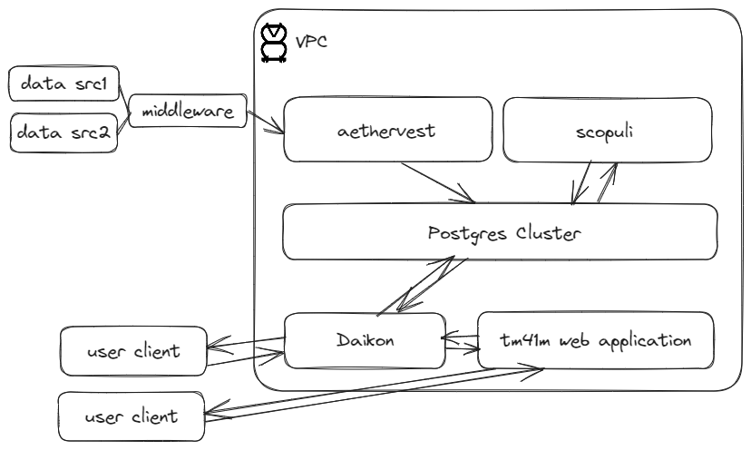

## Home ##

Welcome to [tm41m]'s technical documentation website. This site provides information, guidance, and tutorials on the systems used to produce applications on our main website.

## Overview ##

To produce our data-driven content, our organization maintains the following repositories:

1. [daikon] - A REST API built with [Flask] used by our web application's user-facing components to generate content.

2. [scopuli] - The transformation layer built with [dbt]. This is where raw data sourced from different applications is turned into enriched & aggregated insights.

3. [aethervest] (private)- A collection of cron scheduled jobs powered by various python-based libraries that crawl different sources to produce the building blocks of data used by other systems.

4. [tm41m.io] - Our technical documentation page powered by Github pages.

5. [tm41m.com] - Our main web application where our most user-facing content can be found.

This crude high-level diagram illustrates how these systems interact with each other:

## Contact ##
If you're interested in contributing, feel free check out our [github organization] or drop us a note at [contact@tm41m.com].

----
[tm41m]: https://tm41m.com
[github organization]: https://github.com/tm41m
[contact@tm41m.com]: contact@tm41m.com
[daikon]: https://github.com/tm41m/daikon
[scopuli]: https://github.com/tm41m/scopuli
[aethervest]: https://github.com/tm41m/aethervest
[dbt]: https://docs.getdbt.com/docs/introduction
[tm41m.io]: #home
[tm41m.com]: https://tm41m.com
[flask]: https://flask.palletsprojects.com/en/2.3.x/
